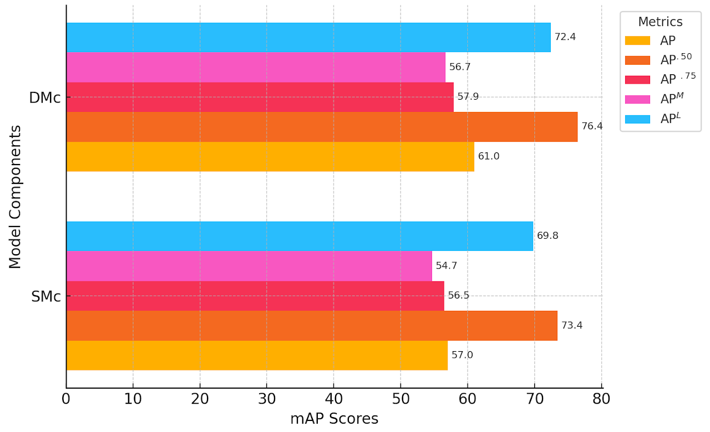

## VisualCent: Visual Human Analysis using Dynamic Centroid Representation (IEEE FG 2025)

### Code will be available soon

  
   
  <strong>Model Overview</strong>

 
<strong>Compuational Analysis</strong>

 
<strong>Components Assessment</strong>

