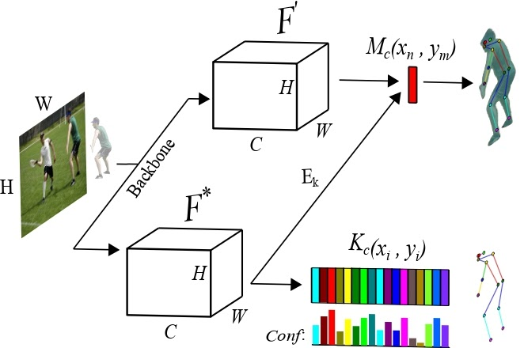

## VisualCent: Visual Human Analysis using Dynamic Centroid Representation (Code Will Be Soon Available)

#### IEEE FG 2025 

<video width="640" height="360" controls>
  <source src="https://github.com/niazahamd89/VisualCent/blob/main/Figs/Recording_New.mp4" type="video/mp4">
  Your browser does not support the video tag.
</video>

  
   
  <strong>Model Overview</strong>

 
<strong>Compuational Analysis</strong>

